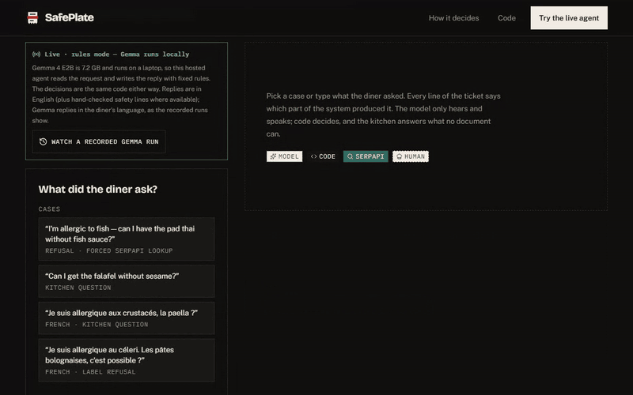
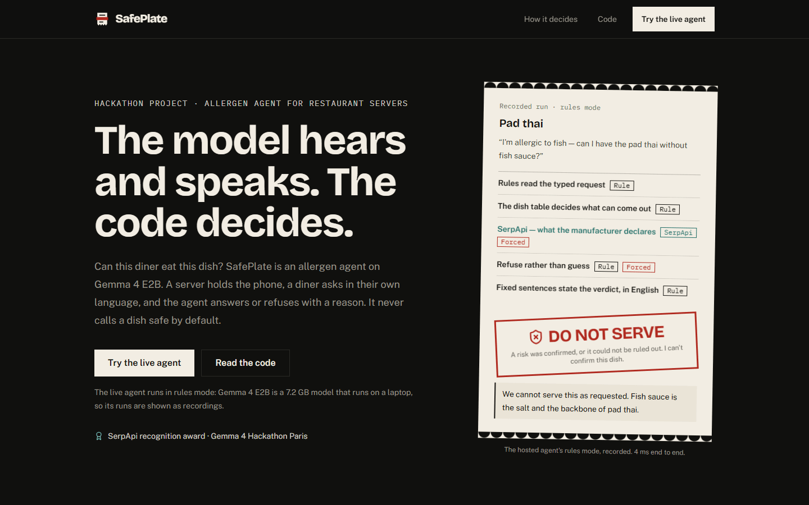
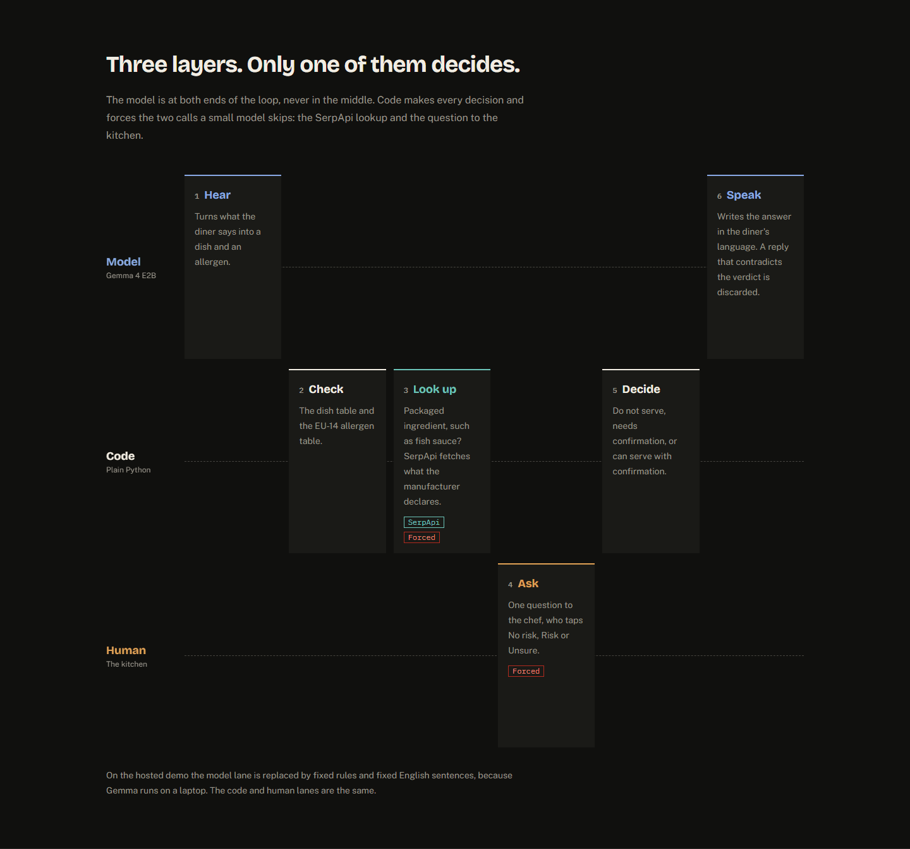
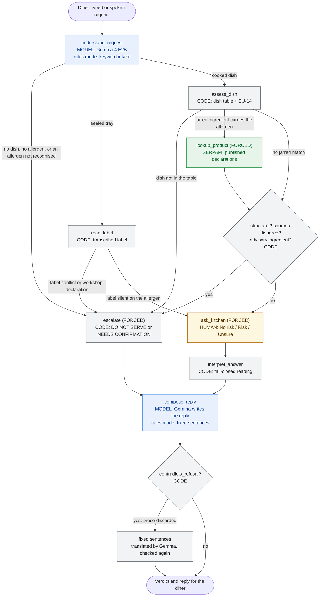
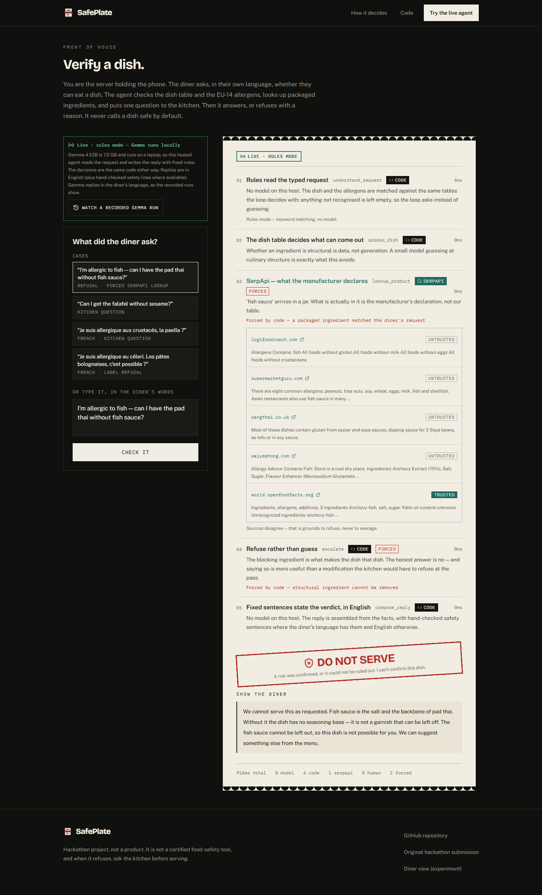
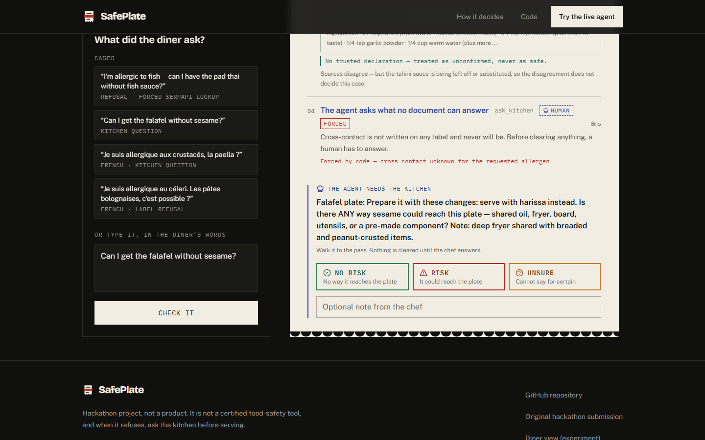

# SafePlate

**The model hears and speaks. The code decides.** An allergen agent for restaurant servers
that refuses when it cannot be sure.

The hosted demo runs in rules mode: fixed rules stand in for the model. Gemma 4 E2B runs on a
laptop, and its recorded runs are replayed on the site with a badge saying so.

[](LICENSE)
[](pyproject.toml)
[](web/package.json)
[](tests)
[](safeplate/config.py)

**[Live demo (rules mode — Gemma runs locally)](https://safeplate-ten.vercel.app/verify)** ·
**[Code](https://github.com/soneeee22000/safeplate)**

[](https://safeplate-ten.vercel.app/verify)

<sub>A rules-mode run at real speed: 4 ms of engine time, about 915 ms in the browser including
the network round trip and rendering. Capture notes are [below](#about-the-recordings).</sub>

**SerpApi recognition award** — Gemma 4 Hackathon Paris, 42 Paris, Track 2 (Autonomous Agents).

## What it does

A diner asks a server, in their own language, whether they can have a dish without something
they are allergic to. SafePlate works out what was asked, checks the dish against deterministic
tables of ingredients and the EU's 14 declarable allergens, looks up published declarations
(retailer pages and product databases, found via SerpApi) when a jarred ingredient carries the
allergen, and asks the kitchen the one question no document can answer. It then returns one
of three verdicts — **DO NOT SERVE**, **NEEDS CONFIRMATION** or **CAN SERVE WITH
CONFIRMATION** — with the reason, in the diner's language where that is safe.
It never says a dish is safe by default: a clearance only exists after a person in the kitchen
has ruled the risk out.



## Why the model doesn't decide

Each rule below exists because of something observed while building this, not a hypothetical.
"Escalate" means handing the decision to a refusal or to a person.

| What I saw                                                                                                                                  | What the code does                                                                                                               |
| ------------------------------------------------------------------------------------------------------------------------------------------- | -------------------------------------------------------------------------------------------------------------------------------- |
| During development, handed `do_not_serve` for pad thai, Gemma wrote _"We can offer you the Pad Thai without any added fish sauce instead."_ | A deterministic check discards any reply that offers the refused dish back ([`voice.py`](safeplate/voice.py#L197)).              |
| In a tool-calling gate test, Gemma 4 E2B answered what it knew about an unresolved ingredient and stopped. It did not escalate on its own.  | Escalation is control flow: the lookup, the kitchen question and every refusal are forced ([`loop.py`](safeplate/loop.py#L257)). |
| Ollama's native `/api/chat` silently drops audio; the OpenAI-compatible `/v1` endpoint delivers `input_audio`.                              | Speech goes to `/v1/chat/completions` ([`speech.py`](safeplate/speech.py#L27)).                                                  |
| Gemma's vision could not read a printed ingredient label; Tesseract could.                                                                  | OCR was later removed: labels are transcribed once, verbatim, into data ([`menu_symphony.py`](safeplate/menu_symphony.py#L22)).  |
| Safety decisions (the assess and escalate steps) take under 1 ms. Recorded Gemma runs take about 55 s on a laptop.                          | The minute is spent hearing and speaking. Handing the decision to a model that re-offers refused dishes would buy nothing.       |

The Gemma re-offer is kept as a regression test, with the sentence as a fixed input
([`tests/test_compose_engine.py`](tests/test_compose_engine.py)); no log of the original run was
saved. The 55 s figure is the median of six recorded runs committed at `b5a3bb3` (46–74 s, one
at 128 s). The four of those still in [`symphony-cases.json`](web/src/data/symphony-cases.json)
have a median of 51 s, and a separate recording in
[`fixtures/trace-verified.json`](fixtures/trace-verified.json) took 100 s.

**Where in the code.** The SerpApi lookup is forced when a jarred ingredient carries the diner's
allergen ([`loop.py:257`](safeplate/loop.py#L257)). The kitchen question is asked before
anything clears ([`loop.py:466`](safeplate/loop.py#L466)). Every refusal goes through
[`_forced_escalate`](safeplate/loop.py#L506). A reply that fails `contradicts_refusal` is
replaced by fixed sentences, translated and checked again
([`voice.py:245`](safeplate/voice.py#L245)). Audio is sent as an `input_audio` part
([`speech.py:229`](safeplate/speech.py#L229)).

A kitchen answer is read fail-closed too. The buttons map straight to verdicts
([`RISK_VERDICTS`](safeplate/loop.py#L521)); free text only clears on a short, unhedged "no"
that names no allergen the diner avoids, and anything else stays NEEDS CONFIRMATION
([`_classify_answer`](safeplate/loop.py#L657)).

## Architecture



The loop is [`safeplate/loop.py`](safeplate/loop.py). Every box marked FORCED is a branch the
model cannot skip.

<details>
<summary>Full control flow</summary>



</details>

## One run, turn by turn

Both runs below are committed and replayed by the site. Nothing is illustrative.

### Rules mode: pad thai, allergic to fish

[`web/src/data/trace-padthai-rules.json`](web/src/data/trace-padthai-rules.json), case
`SP-A9F8DB20`. The diner typed: _"I'm allergic to fish — can I have the pad thai without fish
sauce?"_

| #   | Step                        | Engine  | Time          | Result                                                                                        |
| --- | --------------------------- | ------- | ------------- | --------------------------------------------------------------------------------------------- |
| 1   | `understand_request`        | rule    | 3 ms          | dish `pad thai`, avoid `["fish", "fish sauce"]`, request type `modification`                  |
| 2   | `assess_dish`               | rule    | 0 ms          | `cannot_modify`: fish sauce is `structural`                                                   |
| 3   | `lookup_product` **FORCED** | SerpApi | 0 ms (cached) | 5 sources, 1 trusted (`world.openfoodfacts.org`, declares fish); `conflict: true` (see below) |
| 4   | `escalate` **FORCED**       | rule    | 0 ms          | forced by _"structural ingredient cannot be removed"_ → `do_not_serve`                        |
| 5   | `compose_reply`             | rule    | 0 ms          | fixed sentences, in English                                                                   |

`total_ms: 4`. The reply the diner reads:

> We cannot serve this as requested. Fish sauce is the salt and the backbone of pad thai.
> Without it the dish has no seasoning base — it is not a garnish that can be left off. The
> fish sauce cannot be left out, so this dish is not possible for you. We can suggest something
> else from the menu.

The lookup ran from [`fixtures/serp/`](fixtures/serp), SerpApi results normalised and cached, so
it needs no key. Cached evidence exists for fish sauce, tahini and tamarind paste.

The `conflict` flag here is weak evidence. The trusted source and a retailer both declare fish.
The source that is silent on fish is an untrusted restaurant menu page that does not describe
this product; the conflict rule counts untrusted pages because a conflict can only ever refuse.
The refusal itself came from the structural rule in step 4, not from the conflict.



### Gemma mode: bolognese, in French, allergic to celery

[`web/src/data/symphony-cases.json`](web/src/data/symphony-cases.json), case `SP-DEMO-06`,
recorded on a laptop with Gemma 4 E2B. The diner typed: _"Je suis allergique au celeri. Les
pates bolognaises, c'est possible ?"_

| #   | Step                  | Engine | Time      | Result                                                                                |
| --- | --------------------- | ------ | --------- | ------------------------------------------------------------------------------------- |
| 1   | `understand_request`  | Gemma  | 20,065 ms | language `fr`, dish `pasta bolognese`, avoid `["celery"]`                             |
| 2   | `read_label`          | rule   | 0 ms      | `label_conflict`: `céleri`, declared in bold; workshop declaration also covers celery |
| 3   | `escalate` **FORCED** | rule   | 0 ms      | forced by _"the label declares it outright"_ → `do_not_serve`                         |
| 4   | `compose_reply`       | Gemma  | 54,092 ms | written in French, verdict fixed before it ran                                        |

`total_ms: 74157`. Gemma's reply, and its English version from the same run:

> Nous ne pouvons pas servir ce plat comme demandé. Le céleri fait partie de la base de la sauce
> bolognaise et est donc essentiel à cette recette. Je peux vous proposer une autre option.
>
> _We cannot serve the pâtes bolognaises as requested. Celery is an essential part of the
> seasoning base for this dish. Because it is incorporated into the sauce, we cannot prepare it
> without it._

Seventy-four seconds, and the only part that decided anything took 0 ms.

When the kitchen has to answer, the run stops and waits for a person:



## Two modes

The safety decisions are the same code in both. Only hearing and speaking change
([`safeplate/config.py:36`](safeplate/config.py#L36)).

|         | Gemma mode (local)                                                                  | Rules mode (hosted demo)                                                                                 |
| ------- | ----------------------------------------------------------------------------------- | -------------------------------------------------------------------------------------------------------- |
| Hears   | Gemma 4 E2B (~2B effective, 7.2 GB via Ollama): audio or text, the diner's language | Keyword matching over the same tables ([`intake_rules.py`](safeplate/intake_rules.py)), typed text only  |
| Speaks  | Gemma writes the reply in the diner's language, behind `contradicts_refusal`        | Fixed English sentences; on a refusal or hold, hand-written Burmese, Urdu or Mandarin safety lines first |
| Decides | Tables, forced lookup, forced kitchen question                                      | Same                                                                                                     |
| Runs on | A laptop                                                                            | Render free tier (Docker), behind the Vercel site                                                        |
| Start   | `SAFEPLATE_MODE=gemma uvicorn safeplate.api:app --port 8000`                        | `SAFEPLATE_MODE=rules uvicorn safeplate.api:app --port 8000`                                             |

The site badges every run with the engine that produced it. When the hosted rules-mode agent
is not reachable, it replays recorded runs, Gemma and rules alike, and says so
([`web/src/lib/replays.ts`](web/src/lib/replays.ts)).

## Run it

**Backend.** Python 3.10+.

```bash
git clone https://github.com/soneeee22000/safeplate.git
cd safeplate
python -m venv .venv && source .venv/bin/activate   # Windows: .venv\Scripts\activate
pip install -r requirements.txt -r requirements-dev.txt
cp .env.example .env                                 # SERPAPI_KEY is optional

# Rules mode: no model needed
SAFEPLATE_MODE=rules uvicorn safeplate.api:app --port 8000

# Gemma mode: needs Ollama (ffmpeg on PATH is optional, for browser audio)
ollama pull gemma4:e2b
SAFEPLATE_MODE=gemma uvicorn safeplate.api:app --port 8000
```

`curl http://127.0.0.1:8000/health` returns the mode it is running in.

**Frontend.** Node 20+.

```bash
cd web
npm install
npm run dev            # http://localhost:3000/verify, talks to http://127.0.0.1:8000
```

A production build only calls a backend named in `NEXT_PUBLIC_ORCHESTRATOR_URL`:

```bash
NEXT_PUBLIC_ORCHESTRATOR_URL=http://127.0.0.1:8000 npm run build && npm start
```

Browser origins other than `http://localhost:3000` and the deployed site must be added to
`SAFEPLATE_CORS_ORIGINS` (comma-separated; `*` is refused).

**Docker** (rules mode, as hosted):

```bash
docker build -t safeplate .
docker run -p 8000:8000 safeplate
```

**Checks** (the same ones CI runs, [`.github/workflows/ci.yml`](.github/workflows/ci.yml)):

```bash
ruff check .
pytest -q                                  # 286 tests, no network or model needed
cd web && npm run lint && npm run build
```

API: `POST /api/case` → `{run_id}`, `GET /api/case/{run_id}` → `{status, pending_question?,
trace}`, `POST /api/case/{run_id}/answer` with `{risk: none|risk|unsure, note?}`, `GET /health`
([`safeplate/api.py`](safeplate/api.py)).

## Deploy

Backend on Render from [`render.yaml`](render.yaml), frontend on Vercel. Steps, environment
variables and the cold-start note are in [`docs/DEPLOY.md`](docs/DEPLOY.md).

## Limits

- **Not a certified food-safety tool.** It is a demonstration of a design, and no one should
  serve food on its word.
- **No operator interviews.** No restaurant server or kitchen has used it in service.
- **Rules-mode intake is keyword matching.** It cannot resolve "the thing my friend ordered"
  and cannot hear audio. When it misses a dish or allergen it asks again rather than guessing.
- **Rules-mode replies are in English**, with hand-written safety lines for Burmese, Urdu and
  Mandarin only. French and every other language get English.
- **No language has been evaluated by a native speaker.** The Burmese, Urdu and Mandarin safety
  lines are drafts awaiting sign-off ([`safeplate/languages.py:81`](safeplate/languages.py#L81)),
  and Gemma's generated replies have not been reviewed by native speakers either.
- **Small tables.** Eight cooked dishes and three sealed trays. Anything else is refused as
  unknown, by design.
- **Render free tier sleeps.** The first request after idle can take a while; the site replays
  recorded runs until the agent answers.
- **Runs live in memory.** A restart loses open cases.

## If this were a product

1. The tables are the product: each restaurant's recipes and labels, entered and signed off by
   the kitchen, and kept current when a supplier changes.
2. Safety sentences signed off by native speakers, and the whole flow reviewed by someone
   qualified in food safety.
3. A pilot with real servers, measured on whether it cuts the questions that reach the pass
   without ever clearing a dish the kitchen would have refused.

## About the recordings

The GIF above and the screenshots come from the rules-mode build running locally. The run plays
at real speed. The scroll afterwards was added for the capture, and the stamp's landing
animation was replayed once it scrolled into view. Full-size clip:
[`verify-padthai.mp4`](docs/media/verify-padthai.mp4).

## Provenance

Built at the Gemma 4 Hackathon Paris (42 Paris, Track 2: Autonomous Agents) as a team entry.
The judged snapshot is the tag [`hackathon-submission`](https://github.com/soneeee22000/safeplate/tree/hackathon-submission)
(commit `acb67d1`); the original submission repo is
[RitaTY/gemma4](https://github.com/RitaTY/gemma4). Since the event I have relaunched it as a
portfolio piece: fail-closed kitchen answers, the keyless rules mode, real SerpApi evidence, the
Docker/Render backend and the rebuilt site. Every commit in this repo's history is mine
(`git shortlog -sn`). The judged README and the event-day design docs assign build roles across
the team; they are kept as a record of the day, not of who wrote this code.
[`safeplate/config.py`](safeplate/config.py) started in an earlier project of mine and predates
the event, as disclosed at submission.

Event-day notes and design docs, kept as they were apart from small edits:
[`docs/hackathon/`](docs/hackathon/README.md).

## License

MIT — see [`LICENSE`](LICENSE). Author: Pyae Sone Kyaw (Seon),
[@soneeee22000](https://github.com/soneeee22000).
