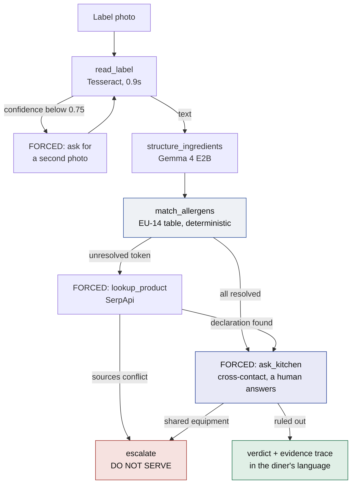
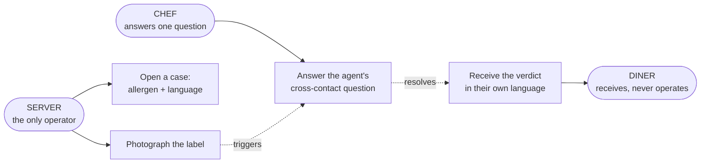

# SafePlate

**An allergen agent that routes around failure — and refuses when it can't be sure.**

[](LICENSE)
[](https://ollama.com/library/gemma4)
[](https://ollama.com)
[](https://python.org)
[](https://github.com/RitaTY/gemma4/commits/main)

A customer asks, in a language the server doesn't speak, whether a dish contains nuts. The
server has thirty seconds, a jar labelled in another language, and a legal obligation not to
guess.

SafePlate photographs the label, reads it on-device, maps ingredients to the EU's 14 declarable
allergens, looks up the manufacturer's declaration when the label doesn't resolve, **asks the
kitchen the one thing no label can tell it**, and answers in the diner's language — or refuses,
and says exactly why. Its most valuable output is often `DO NOT SERVE — I can't confirm`.

Built for the **Gemma 4 Hackathon | Paris**, Track 2 (Autonomous Agents), 42 Paris.

### Try it

|                      |                                                                                                                |
| -------------------- | -------------------------------------------------------------------------------------------------------------- |
| **Operator console** | **<https://safeplate-ten.vercel.app/verify>** — open a case, watch the agent work, answer the kitchen yourself |
| **Project page**     | <https://safeplate-ten.vercel.app>                                                                             |

> These pages **replay a recorded run**. They are genuinely interactive — the trace prints step
> by step and the kitchen question waits for an answer you type — but Gemma is not executing
> behind them. The model is 7.2 GB behind Ollama with a local Tesseract binary, so the agent
> itself runs on a laptop, not on a web host. The interface says which mode it is in.

---

## The design decision

**Gemma 4 plans, reads, translates and chooses tools. A deterministic table decides whether an
ingredient is an allergen.**

| Gemma 4 E2B owns                             | The lookup table owns                   |
| -------------------------------------------- | --------------------------------------- |
| Reading OCR text into structured ingredients | **Whether an ingredient is declarable** |
| Translating staff to customer language       | `casein → milk`, `semolina → gluten`    |
| Choosing the next tool                       |                                         |
| Composing the explanation, or the refusal    |                                         |

A language model is never the last line of defence. The reasoning is learned; the safety call
is deterministic and auditable.

## Architecture



Everything except `lookup_product` runs on-device. Every branch marked **FORCED** is compelled
by the orchestrator, not chosen by the model — see
[Escalation is enforced by the loop](#escalation-is-enforced-by-the-loop-not-by-the-model).

**`ask_kitchen` is the step that makes this more than a label reader.** A clean label never
clears a dish on its own, because cross-contact is not written on any label and never will be.

## Who it's for



**One device, one screen, three people served.** The server holds the phone. The chef answers on
that same screen — there is no second app. The diner never touches it.

A server holding a jar has no allergen training, no time, and often no shared language with the
person asking. Today the options are guess, refuse everything, or go find a chef. All three are
bad — and the first is the one that sends people to hospital.

SafePlate's job is not to be clever. It is to turn thirty seconds of guessing into a sourced
answer, or an honest refusal that a manager can stand behind.

## Why this matters commercially

|                   |                                                                                                                                                             |
| ----------------- | ----------------------------------------------------------------------------------------------------------------------------------------------------------- |
| **Who pays**      | Restaurant groups and hospitality franchises — the buyer is whoever signs off on food-safety compliance, not the kitchen                                    |
| **Budget line**   | Food-safety training and compliance tooling, an existing line item                                                                                          |
| **The wedge**     | Allergen declaration is legally mandated in the EU under Regulation (EU) No 1169/2011 — the 14 allergens are not optional, so the obligation already exists |
| **Why on-device** | No per-query cost, no network dependency in a kitchen, no customer health data sent anywhere                                                                |
| **Defensibility** | The moat is the verified allergen taxonomy and the refusal policy, not the model — anyone can call an LLM, few will build the part that says _no_           |

**Stated honestly:** this is a hackathon prototype, not a validated product. Market size,
willingness to pay, and per-restaurant liability exposure are **assumptions we have not
tested** — no operator has been interviewed. The strongest evidence we have is that the legal
obligation is real and the current alternative is a server guessing.

## Escalation is enforced by the loop, not by the model

We measured this rather than assuming it. Given ingredients including `casein` and the
unresolved token `natural flavourings`, Gemma 4 E2B correctly called `match_allergens` — but
handed back `"unresolved": ["natural flavourings"]`, **it did not escalate.** It answered about
the casein and stopped.

So escalation is control flow, not a hope:

```python
if result.unresolved:            # not "if the model decides to"
    force_tool("lookup_product")

if sources_conflict(evidence):
    force_tool("escalate")       # refuse; never average conflicting sources
```

**Reliability comes from the harness, not from a 2B model remembering to plan well.** Track 2
asks whether an agent survives contact with failure; a loop that _guarantees_ escalation is a
better answer than a model that usually remembers.

## Measured, not assumed

| Check                                | Result                                    |
| ------------------------------------ | ----------------------------------------- |
| E2B emits well-formed **tool calls** | Pass — arguments extracted verbatim       |
| E2B **consumes** tool results        | Pass — correct follow-up answer           |
| E2B **escalates unprompted**         | **Fail** — hence the forced loop above    |
| E2B **vision** on dense printed text | **Fail** — echoed the prompt, then digits |
| **Tesseract** OCR on a label         | Pass — **0.90 s**, clean transcription    |

Latency: **24.0 s** first tool-calling turn (schemas in context, model cold), **7.3 s** warm,
**0.90 s** OCR. A six-step run is roughly 60 s.

## Features

- **On-device label reading** — Tesseract (`eng+fra`); no photo leaves the machine
- **EU-14 allergen matching** — Regulation (EU) No 1169/2011, with synonym resolution
- **Guaranteed escalation** — unresolved ingredients always trigger an external lookup
- **The agent asks a human** — cross-contact is evidence no document contains, so it stops and asks the kitchen
- **Refusal as a first-class outcome** — conflicting sources produce `DO NOT SERVE`, never an average
- **Multilingual output** — verdict rendered in the diner's language
- **Visible agent trace** — every tool call, result and decision shown, not summarised, with each
  step labelled by what produced it: Gemma, a deterministic rule, SerpApi, or a human

## Tech stack

| Layer             | Choice                               | Why                                                 |
| ----------------- | ------------------------------------ | --------------------------------------------------- |
| Model             | Gemma 4 **E2B** via Ollama           | Runs offline on a laptop; native function calling   |
| Model call        | Ollama HTTP `/api/chat` with `tools` | `think:false`, `temperature:0`                      |
| OCR               | Tesseract (`eng+fra`)                | E2B vision fails on dense print; Tesseract is 0.9 s |
| Orchestrator      | FastAPI                              | Owns control flow and forced escalation             |
| Allergen logic    | Plain Python table                   | Deterministic and auditable by design               |
| External evidence | SerpApi (`engine=google`)            | Manufacturer declarations the label omits           |
| Interface         | Next.js 16 · TypeScript · Tailwind 4 | Operator console + agent trace, deployed on Vercel  |

> **`think: false` is load-bearing.** Gemma 4 E2B otherwise emits a chain-of-thought into
> Ollama's separate `thinking` field — invisible output you still wait for, at roughly 3x the
> latency. The Ollama Python client (0.4.7) has no `think` parameter, which is why
> `safeplate/llm.py` calls the loopback HTTP API directly.

## Getting started

**Prerequisites:** Python 3.10+, [Ollama](https://ollama.com), and
[Tesseract OCR](https://github.com/tesseract-ocr/tesseract).

```bash
git clone git@github.com:RitaTY/gemma4.git
cd gemma4

ollama pull gemma4:e2b        # 7.2 GB
pip install -r requirements.txt
```

Tesseract's binary path and language data are set in `safeplate/config.py`; the `eng` and `fra`
data ship in `tessdata/`, so no extra download is needed.

```python
from safeplate.ocr import DocumentReader
from safeplate.llm import chat

label_text = DocumentReader().read("label.jpg")
reply = chat(system="Extract the ingredient list.", user=label_text)
```

Optional, for the external lookup only:

```bash
export SERPAPI_KEY=...
```

## Project structure

```
safeplate/          config · llm (tuned Ollama client) · ocr (Tesseract reader)
fixtures/           recorded runs — one refusal, one clearance. THE FROZEN CONTRACT.
web/                Next.js operator console and landing page
  src/lib/trace.ts        the same schema, typed
  src/lib/orchestrator.ts the FastAPI client + demo replay
docs/
  safeplate-mvp-decision.md  scope, persona, rubric mapping — read this first
  safeplate-spec.md          tool contracts, gate results, sequence diagram
tessdata/           Tesseract language data (eng, fra)
```

**`fixtures/trace-refusal.json` is the contract everything agrees on.** The Python loop emits
that shape and the interface renders it, so both sides were built in parallel without waiting
on each other. Start there.

Full technical spec, including the frozen tool contracts and the EU-14 allergen set:
**[`docs/safeplate-spec.md`](docs/safeplate-spec.md)**

### Running the interface

```bash
cd web
npm install
npm run dev          # http://localhost:3000/verify
```

It talks to the orchestrator at `http://127.0.0.1:8000` when that is up, and replays a recorded
case when it is not — labelled in the interface so the two are never confused. Point it
elsewhere with `NEXT_PUBLIC_ORCHESTRATOR_URL`.

The orchestrator contract the interface expects:

```
POST /api/case                  -> { run_id }
GET  /api/case/{run_id}         -> { status, pending_question?, trace }
POST /api/case/{run_id}/answer  -> { status, trace }
GET  /health
```

`status` is one of `running`, `awaiting_human`, `complete`, `failed`. A run genuinely stops on
`awaiting_human` until the kitchen answers.

## Team

Built at the Gemma 4 Hackathon, 42 Paris, by a team of four.

|                                                                         |                                                   |
| ----------------------------------------------------------------------- | ------------------------------------------------- |
| **Rita**                                                                | Product, frontend, agent trace view, pitch        |
| **Afaq**                                                                | SerpApi lookup, evidence normalisation, FastAPI   |
| **Yan**                                                                 | Agent loop, tool registry, forced escalation      |
| **Pyae Sone (Seon)** — [@soneeee22000](https://github.com/soneeee22000) | Gemma 4 integration, OCR, EU-14 table, evaluation |

## Provenance

`llm.py`, `ocr.py` and `config.py` were extracted from an earlier offline-document project by
[@soneeee22000](https://github.com/soneeee22000) and predate the hackathon. Everything else was
built during the event. Disclosed per competition rules §4.3.

## Licence

MIT — see [`LICENSE`](LICENSE).
