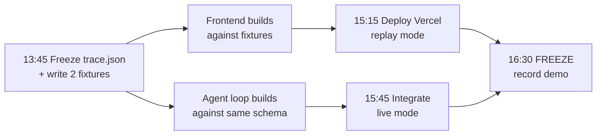

# SafePlate — frontend build plan

**Written 2026-07-25 13:45 · Deadline 18:00 GMT+2 · ~4h15m remaining**
Companion to `safeplate-mvp-decision.md`. Read that first for scope.

---

## 0. The constraint that shapes everything

**Vercel cannot run the demo.** Gemma 4 E2B is 7.2 GB behind Ollama on one laptop; Tesseract
is a local binary. A hosted page can never execute the agent.

So there are **two artifacts, one codebase**:

| Artifact            | Where          | Mode             | Purpose                                     |
| ------------------- | -------------- | ---------------- | ------------------------------------------- |
| **The Kaggle demo** | Pyae's laptop  | `?live=1`        | Real Gemma + Tesseract + SerpApi. Recorded. |
| **The Vercel page** | `*.vercel.app` | replay (default) | Landing + team + interactive trace replay.  |

**Same `index.html`.** One flag switches the data source: `fetch('/api/run')` vs
`fetch('fixtures/trace-refusal.json')`.

> **Honesty gate (R7):** the deployed page says _"Recorded run — the agent runs locally on
> Gemma 4 E2B"_ above the trace. It is never labelled "live". It is genuinely interactive —
> you can step the trace, switch cases, and read every tool call — so it earns the label
> **"Interactive demo (recorded trace)"**.

---

## 1. Build order — frontend first, without blocking the loop



**The freeze in step A is the whole unlock.** Fifteen minutes spent on the schema buys two
teams working in parallel for two hours. Skip it and the frontend blocks on the backend.

### `trace.json` — the frozen contract

```jsonc
{
  "case_id": "str",
  "allergen": "str", // what the diner asked about
  "diner_language": "str", // ISO code — Gemma composes the verdict in this
  "verdict": "verified | needs_confirmation | do_not_serve",
  "steps": [
    {
      "n": 1,
      "actor": "agent | tool | human",
      "tool": "read_label | match_allergens | lookup_product | ask_kitchen | escalate",
      "reasoning": "str", // why the agent chose this call
      "forced": true, // set when the ORCHESTRATOR forced it, not the model
      "args": {},
      "result": {},
      "duration_ms": 0,
    },
  ],
  "evidence": [{ "source": "str", "url": "str", "text": "str" }],
  "explanation": "str", // final text, in diner_language
}
```

**`forced: true` is the most important field on the page.** It is the visual proof of the
finding in `safeplate-spec.md` §2 — that reliability comes from the harness, not from hoping a
2B model remembers to escalate. Render it as a distinct badge. Judges should be able to _see_
the architecture.

### Two fixtures, hand-written now

1. `fixtures/trace-refusal.json` — glare → re-shoot → `natural flavourings` unresolved →
   SerpApi → cross-contact unknown → `ask_kitchen` → _"same fryer as the calamari"_ →
   **DO NOT SERVE** in Arabic. **This is the hero. Build the UI against this one.**
2. `fixtures/trace-verified.json` — clean label, no unresolved tokens, **VERIFIED**.

---

## 2. Design direction

Subject world: restaurant service. The artifact that physically travels between the floor and
the kitchen is **the ticket on the pass**. That is the metaphor, and it is not decoration — the
agent's output genuinely is a ticket the server carries to the kitchen and back.

### Palette — 6 values

| Token        | Hex       | Role                                               |
| ------------ | --------- | -------------------------------------------------- |
| `--ink`      | `#10100E` | Console chrome. Warm/olive-shifted, not blue-black |
| `--paper`    | `#F2EDE3` | The ticket. Receipt stock, not white               |
| `--verified` | `#2E7D5B` | Deep service green — **not** acid                  |
| `--confirm`  | `#C87A28` | Amber. The "ask the kitchen" state                 |
| `--refuse`   | `#B02A20` | Printed-warning red, **not** neon                  |
| `--muted`    | `#6B675C` | Secondary type, rules, timestamps                  |

The contrast _is_ the design: a dark operator console framing a light paper ticket. Deliberately
avoids the three AI-default looks — it is neither cream-and-serif, nor black-with-acid-accent,
nor broadsheet hairlines.

### Type — 3 roles

- **Display:** Bricolage Grotesque — characterful, variable, used with restraint
- **Body:** Public Sans — plain, institutional, high legibility
- **Utility/data:** IBM Plex Mono — the ticket, the trace, every tool call

### Signature element

**The trace prints like a thermal receipt.** Line by line, monospace, the ticket emerging from
the top of the card with a perforated edge; the verdict stamped across it at the end. One
orchestrated page-load moment, then stillness. `prefers-reduced-motion` renders it complete.

That is the single risk, and it is justified: it is literally how an order moves through a
restaurant.

---

## 3. Page structure — one page, four sections

```
┌──────────────────────────────────────────────┐
│  SAFEPLATE          Gemma 4 · Track 2        │  ← eyebrow, thin rule
│                                              │
│  The label says nothing about               │  ← thesis headline
│  the fryer.                                  │
│  Allergen verification that refuses          │
│  when it cannot be sure.        [Run a case] │
├──────────────────────────────────────────────┤
│  ┌────────────────────────────────────────┐  │
│  │  ▓▓ TICKET ▓▓ perforated edge          │  │  ← SIGNATURE
│  │  case #  allergen  language            │  │     the trace prints
│  │  1 read_label      0.9s   ⚠ re-shoot   │  │     line by line
│  │  2 match_allergens        unresolved   │  │
│  │  3 lookup_product  FORCED  serpapi     │  │  ← `forced` badge
│  │  4 ask_kitchen     ← human answered    │  │
│  │  ─────────────────────────────────────  │  │
│  │       ⬛ DO NOT SERVE ⬛                 │  │
│  └────────────────────────────────────────┘  │
│  [ refusal case ] [ verified case ]          │  ← swap fixture
├──────────────────────────────────────────────┤
│  HOW IT WORKS — 5 tools, deterministic       │  ← not numbered 01/02/03;
│  escalation, Gemma at the core               │     it's a loop, not a sequence
├──────────────────────────────────────────────┤
│  THE TEAM  Rita · Afaq · Yan · Pyae          │
│  repo · writeup · MIT                        │
└──────────────────────────────────────────────┘
```

---

## 4. Stack — deliberately no build step

| Layer  | Choice                              | Why                                                                              |
| ------ | ----------------------------------- | -------------------------------------------------------------------------------- |
| Markup | Single `index.html`                 | No `package.json` exists. A Next.js scaffold costs 45 min for zero rubric points |
| Styles | Hand-written CSS, custom properties | Design tokens in `:root`. No framework to fight                                  |
| Fonts  | Google Fonts, 3 families            | `next/font` is irrelevant without Next                                           |
| Logic  | Vanilla JS, ~150 lines              | Fetch a fixture, render steps, animate                                           |
| Deploy | `vercel --prod` on a static dir     | Zero config, ~2 minutes                                                          |

**No React. No Tailwind. No shadcn.** They are the right call on a two-week project and the
wrong call with four hours on the clock and no scaffold to inherit.

---

## 5. Timeline

| Time            | What                                                        |
| --------------- | ----------------------------------------------------------- |
| **13:45–14:00** | Freeze `trace.json`. Hand-write both fixtures. **Commit.**  |
| 14:00–15:15     | Build `index.html` — landing, ticket, trace animation, team |
| 15:15–15:30     | `vercel --prod`. **Verify the URL returns 200.**            |
| 15:30–15:45     | Wire `?live=1` to the FastAPI orchestrator                  |
| **15:45**       | Integrate with the real loop. One end-to-end run.           |
| **16:30**       | **FREEZE. Record the local live run.**                      |
| 16:30–17:15     | Writeup ≤1,500 words                                        |
| 17:15–17:45     | Attach, submit                                              |

---

## 6. Open risk

**Who is building the agent loop while the frontend is built?**

`safeplate-mvp-decision.md` §8 assigns the loop to Yan, SerpApi to Afaq, the frontend to Rita,
and OCR + the EU-14 table + the eval set to Pyae. If Claude and Pyae now spend 90 minutes on
the frontend, `read_label`, the allergen table and the eval set are unowned — and those are
`match_allergens`, the single deterministic component the whole safety claim rests on.

**This is fine if and only if Yan and Afaq are actively building the loop and the lookup right
now, in parallel.** If they are not, the frontend is a beautiful shell with nothing behind it
at 16:30, and Functionality (20 pts) is where that dies.

Confirm before starting the build.
