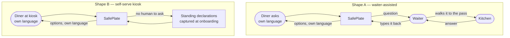

> Status: event-day design doc; see the [README](../README.md) for what shipped.

# SafePlate as an ordering companion — the Symphony.fr onboarding

**Status: product framing. Supersedes the persona section of
[`safeplate-mvp-decision.md`](safeplate-mvp-decision.md) §1.**
That file froze scope for a four-hour hackathon build and named the server as the only
operator. That was the right call under a deadline and it is the wrong call for the
product. This file states the positioning the founder has decided on, and the first
restaurant it is being fitted to.

---

## 1. What SafePlate is

**An ordering companion that sits between the diner, the waiter and the kitchen.**

Not a label reader, not a compliance dashboard, not a chatbot on a restaurant's website.
It is the thing that stands in the gap at the moment of ordering, when a diner has a
question about a dish and the person in front of them cannot answer it.

Two things follow from that framing, and both are load-bearing:

**It works with a waiter or without one.** The agent does not assume a human is holding
the device. The same loop, the same dish data and the same refusal policy sit behind a
tablet on a fine-dining table and behind a self-order kiosk at a fast-food counter. What
changes between the two is who answers the cross-contact question and how long the diner
is willing to wait, not the safety logic.

**It returns choices, not a verdict.** A bare `DO NOT SERVE` ends the conversation and
loses the table. The useful output is: here is what this dish contains, here is what can
and cannot be changed, here is what else on the menu fits, and here is what I cannot
confirm. The diner picks. The agent never picks for them and never overstates what it
knows.

The diner asks in their own language. Priority languages are **Burmese, English, Urdu and
Mandarin**; anything else is auto-detected. That priority list is a deployment choice, not
a model limit — it reflects who is standing in front of these counters and is expected to
change per site.

---

## 2. Who it is for, and who pays

| Role                     | Uses it how                                                                  |
| ------------------------ | ---------------------------------------------------------------------------- |
| **Diner**                | Asks about a dish in their own language, receives options, decides           |
| **Waiter** (if present)  | Carries the kitchen question, types the answer back, is no longer the expert |
| **Kitchen**              | Answers one question about shared equipment — the only thing no document has |
| **Manager / franchisee** | Buys it; owns the consequence of a wrong answer                              |

**Who pays: the restaurant, not the diner.** Specifically whoever signs off on food-safety
process — a franchise operations lead, a group compliance manager, or in a small
independent, the owner. The budget line is food-safety training and compliance tooling,
which already exists because allergen declaration is mandatory in the EU under Regulation
(EU) No 1169/2011.

The diner-pays model was considered and rejected: an allergic diner will not install an app
for one meal, and a per-diner subscription puts the safety-critical component outside the
restaurant's control while leaving the restaurant with the liability.

**Not tested.** No operator has been interviewed, no price has been quoted to anyone, and
willingness to pay is an assumption. See §8.

---

## 3. The two deployment shapes

|                       | **Shape A — waiter-assisted**                     | **Shape B — self-serve kiosk**                        |
| --------------------- | ------------------------------------------------- | ----------------------------------------------------- |
| Where                 | Table tablet, or the waiter's own device          | Fast-food or canteen counter, no staff in the loop    |
| Cross-contact source  | A human answers, live, per case                   | Standing declarations recorded when the site onboards |
| Latency budget        | Minutes — the diner is seated                     | Seconds — there is a queue behind them                |
| What it can clear     | More: a live answer can rule out shared equipment | Less: nothing beyond what was declared in advance     |
| Failure mode to avoid | Waiter answers from memory instead of asking      | Stale declarations treated as current                 |

**The important asymmetry: Shape B can refuse but cannot clear.** Without a human to ask,
the agent has no source for anything the standing declaration does not already cover, so
every case that would have gone to `ask_kitchen` in Shape A resolves as _cannot guarantee_
in Shape B. That is not a bug to engineer away. A kiosk that says "I cannot confirm this
for a severe allergy, and here is who to ask" is correct; a kiosk that guesses is the
product this project exists to prevent.

The dated standing declaration is the only mechanism that lets Shape B clear anything, and
its freshness is the operational burden the restaurant takes on. If a site will not
maintain it, the site gets Shape A or it gets refusals.

---

## 4. First restaurant: Symphony.fr

Symphony.fr catered the Gemma 4 hackathon at 42 Paris. Three of their dishes are onboarded
from photographs of the real packaging.

> Fabriqué par Symphony.fr, 13B rue du Clos de Marolles, 28130 Pierres

The label text below is transcribed verbatim from the packaging. **Bold marks the
allergens the label itself declares in bold**, per the EU convention.

### Dish 1 — Paëlla poisson chorizo et poulet · 425 g · plat numéro JU0T2hac

> **INGRÉDIENTS:** Riz, blanc de poulet (origine Union Européenne), **cabillaud**,
> chorizo, huile d'olive, poivrons, oignons, petits pois, sel, piment doux fumé, safran,
> poivre.
>
> Élaboré dans un atelier qui utilise : gluten, céleri, moutarde, arachides, poisson,
> œufs, soja, lait, fruits à coque, sésame.

Declared: `cabillaud` (cod) → **fish**.

### Dish 2 — Pâtes bolognaises (spécialité du chef Symphony) · 450 g · plat numéro p45jG3yE

> **INGRÉDIENTS:** Fusilli (**gluten**), bœuf haché (origine France), carottes, purée de
> tomates, huile d'olive, concentré de tomate, emmental (**lait**), purée d'oignons, purée
> de carottes, Parmesan (**lait**), glucose, échalotes, ail frais, sel, basilic, paprika,
> **céleri**, origan, poivre, romarin, piment en poudre, laurier.
>
> Élaboré dans un atelier qui utilise : gluten, céleri, moutarde, arachides, poisson,
> œufs, soja, lait, fruits à coque, sésame.

Declared: **gluten**, **milk** (twice — emmental and Parmesan), **celery**. The celery is
the interesting one: it is nineteenth in the list, between paprika and oregano, and a
celery-allergic diner reading a French label at speed will miss it.

### Dish 3 — Gnocchis pesto vegan · 425 g · plat numéro GEBbtKWD

> **INGRÉDIENTS:** Gnocchis (**gluten**), épinards fermes, huile d'olive, basilic, pignons
> de pin, gran prosociano violife, levure diététique (**gluten**), jus de citron, ail en
> poudre, sel, poivre.
>
> Élaboré dans un atelier qui utilise : gluten, céleri, moutarde, arachides, poisson,
> œufs, soja, lait, fruits à coque, sésame.

Declared: **gluten**, twice. Also present, and correctly not in bold: `pignons de pin` —
pine nuts, which are not an EU-14 allergen. The label is compliant; the gap is for the
diners who avoid pine nuts anyway. See §6.

---

## 5. The shared-facility line, and why refusal is the product

The same sentence appears on all three labels, unchanged:

> Élaboré dans un atelier qui utilise : gluten, céleri, moutarde, arachides, poisson,
> œufs, soja, lait, fruits à coque, sésame.

Ten allergen classes. Every dish. This is a shared-facility cross-contact declaration, and
read honestly it means: **no dish Symphony produces can be declared free of any of those
ten allergens.** Not the paella, not the pasta, not the vegan gnocchi.

For a severe allergy — the diner who carries an adrenaline auto-injector — the only honest
verdict on any Symphony dish is **cannot guarantee**. There is no reading of that sentence
that produces "safe".

This is the fact that makes refusal the product rather than a limitation, for three
reasons:

1. **Every competitor has to handle the same sentence, and most ignore it.** A menu-scanning
   app that reads the bolded allergens and reports "contains fish" on the paella has read
   half the label. The half it skipped is the half that matters to the diner with the
   auto-injector.
2. **Ignoring it is the liability.** A restaurant whose ordering system told a diner a dish
   was safe, when its own supplier's label says the facility handles ten allergens, is in a
   worse position than one that said nothing.
3. **The refusal is where the choices come from.** "Cannot guarantee" is only useful if it
   arrives with what to do next — the dishes with the fewest declared conflicts, the option
   to speak to a manager, the option to eat elsewhere. That is the part that is worth
   building and the part nobody builds.

**What SafePlate does with the line:** it applies at the site level, not per dish. A site's
standing facility declaration is recorded once at onboarding, dated, and attached to every
verdict from that site. A diner is told the difference between _this dish contains it_ and
_this kitchen handles it_, because those two facts lead to different decisions.

---

## 6. The worked example: the vegan dish that contains pine nuts

Dish 3 is marketed as **vegan**. It contains `pignons de pin` — pine nuts. Pine nuts are
**not** one of the EU 14: Regulation (EU) No 1169/2011, Annex II, point 8 lists almonds,
hazelnuts, walnuts, cashews, pecans, Brazil nuts, pistachios and macadamias, and nothing
else. The label is therefore compliant in not bolding them. The gap is in the regulation,
not the label: many tree-nut-allergic diners avoid pine nuts all the same. SafePlate carries
them as an advisory — _not an EU-14 allergen, often avoided by tree-nut-allergic diners, ask_
— which holds a nut-allergic diner at `needs_confirmation` and never clears them silently.

This is the case the whole product is built around, and it fails in four separate ways at
once:

| Failure               | What happens                                                                                                                                                                                    |
| --------------------- | ----------------------------------------------------------------------------------------------------------------------------------------------------------------------------------------------- |
| **The word "vegan"**  | Describes animal products, not allergens. It says nothing about gluten and nothing about nuts. A nut-allergic diner scanning a menu for a safe option reads "vegan" as "plant, therefore fine". |
| **The bolding**       | Pine nuts are correctly not bold — they are not an EU-14 allergen. A diner who has learned to scan for bold text will still scan straight past them.                                           |
| **The language**      | `pignons de pin` is not a phrase a non-French speaker maps to "nut", and a phrase-book translation gives "pine kernels", which sounds like a seed.                                              |
| **The facility line** | Even with the pine nuts removed, `fruits à coque` is on the shared-facility list. The dish could not be cleared for a severe nut allergy anyway.                                                |

**Both true at once: this dish is vegan, and it contains gluten twice and pine nuts.**
Those are not contradictory statements. They are the reason a dietary label and an allergen
answer are different products.

How SafePlate answers a nut-allergic diner who asks about the gnocchi:

1. `understand_request` (Gemma) — hears the question in the diner's language, extracts
   `{dish: gnocchis pesto vegan, avoid: [nuts]}`.
2. `read_label` (rule) — the tray is sealed, so its own label decides. `pignons de pin`
   does **not** normalise to `nuts`: it carries the tree-nut-adjacent advisory in
   `ADVISORY_TERMS` in [`safeplate/allergens.py`](../safeplate/allergens.py), because pine
   nuts are not an EU-14 allergen and the label is right not to bold them. An advisory is
   never cleared silently, so the loop escalates and holds the case at
   `needs_confirmation`: only the diner can say whether they avoid pine nuts.
3. The site's facility declaration adds `fruits à coque` independently of the recipe.
4. `compose_reply` (Gemma) — states, in the diner's language: this cannot be confirmed
   yet; the dish contains pine nuts, which are not an EU-14 allergen but are often avoided
   by tree-nut-allergic diners, so ask; they are blended into the sealed sauce, so there
   is no version without them; and separately, this kitchen handles tree nuts, so no dish
   here can be guaranteed nut-free.
5. **The choices**, which is the part that keeps the sale: the paella and the bolognese
   also carry the facility declaration, so none of the three clears a severe nut allergy —
   the honest option set is _speak to the manager_, or _this is not the right kitchen
   today_. If the diner's constraint is an intolerance rather than an anaphylactic allergy,
   the paella has no nut ingredient and the option set is different.

**The severity question is therefore load-bearing and it is asked explicitly.** Nothing in
the label distinguishes "I get a rash" from "I stop breathing", but the answer does. See
§8 for why this is uncomfortable.

---

## 7. Why the answer is a set of choices

The reply the diner receives has a fixed shape, and every part of it comes from data rather
than from generation:

| Part                      | Source                                                              |
| ------------------------- | ------------------------------------------------------------------- |
| What the dish contains    | The transcribed label, per-dish                                     |
| What can be changed       | The dish table's `structural` / `substitutable` / `removable` roles |
| What the kitchen confirms | A human answer (Shape A) or a dated standing declaration (Shape B)  |
| What cannot be confirmed  | The facility declaration, applied site-wide                         |
| What else fits            | The same assessment run across the rest of the menu                 |

Gemma phrases this in the diner's language. It does not decide any of it. The refusal
guardrail described in [`docs/hackathon/kaggle-writeup.md`](hackathon/kaggle-writeup.md) still applies: any
generated sentence that offers to make or adjust a refused dish is discarded in favour of
text assembled from facts, then translated.

---

## 8. What we are not claiming

**Three dishes is a demonstration, not a menu.** Symphony.fr produces far more than three
dishes. Three real labels, photographed and transcribed by hand, prove the reading and the
reasoning work on real French packaging. They do not prove the onboarding scales — that
requires either the supplier's own product data or an OCR pipeline validated on a few
hundred labels, and neither exists yet.

**No restaurant has used this in service.** Symphony.fr catered the hackathon; they have
not deployed SafePlate, have not been asked to, and have not agreed to anything. The
onboarding described here is a fitting exercise done against their packaging, not a pilot.
No diner has been served on the strength of an answer from this system.

**The shared-facility line means near-everything is "cannot guarantee", and that is
commercially awkward.** This has to be said plainly rather than designed around quietly:

- For a severe allergy in any of the ten declared classes, the correct answer on every
  Symphony dish is _cannot guarantee_. A product whose answer is almost always "I cannot
  confirm this" is a hard thing to sell to a restaurant, and a frustrating thing to use.
- The temptation is to soften it — to report only the bolded allergens and treat the
  facility line as boilerplate. That is what the market does. It is also the failure mode
  that puts someone in an ambulance, and taking it would delete the only reason this
  product is different.
- So the design problem is **making an honest refusal useful**, not making it rarer: the
  quality of the alternatives offered, the clarity of _contains_ versus _facility handles_,
  and a route to a human who can actually decide. If that is not solved, the product is
  correct and unsellable.
- Asking the diner to self-report severity is the current mechanism for keeping the answer
  proportionate. It shifts a clinical judgement onto the diner and it has not been reviewed
  by anyone with a medical or legal qualification. **A reviewer should challenge this
  before it goes anywhere near a real service.**

**The languages are a stated priority, not a measured capability.** Burmese, English, Urdu
and Mandarin are the target set. Output quality in each has not been evaluated by a native
speaker, and an allergen refusal mistranslated is worse than no answer.

**Nothing here is a legal opinion.** Regulation (EU) No 1169/2011 requires the fourteen
allergens to be declared. It does not say what an ordering system is permitted to tell a
diner about cross-contact, and we have not had that question answered by a lawyer.
