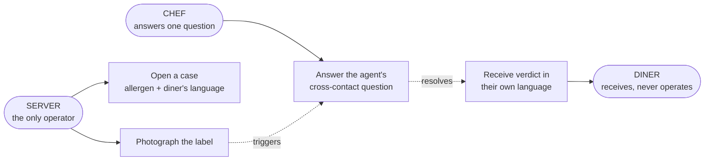

# SafePlate — MVP decision & use-case flow (FROZEN)

**Decided 2026-07-25 13:30 Paris · Submission closes 18:00 GMT+2 · ~4h30m remaining**
Supersedes the use-case diagram in `image.png` and §4/§10 of `safeplate-spec.md`.

> **Stop debating scope. This file is the answer.** Anything not in §3 is out of the MVP.

---

## 0. Verified facts (checked against primary sources, not assumed)

| Fact                     | Value                                                      | Source                         |
| ------------------------ | ---------------------------------------------------------- | ------------------------------ |
| Deadline                 | **Jul 25 2026, 18:00 GMT+2** ("5 hours to go" at 13:26)    | Kaggle competition page        |
| Writeup status           | **None created yet** — "You haven't created a writeup yet" | Kaggle competition page        |
| Field                    | **52 entrants · 0 teams · 0 submissions**                  | Kaggle competition page        |
| SerpApi plan             | **Free · 250 searches/month · 0 used**                     | serpapi.com/dashboard          |
| Terminal recording valid | Yes — explicitly listed as an accepted demo                | Kaggle Submission Requirements |

**Consequence of the SerpApi number:** 250 searches is ample. Do **not** spend time chasing
starter credits. Do cache every response to `fixtures/` so the demo runs with the wifi off.

---

## 1. Who SafePlate is for

**Operator (holds the phone): the server.**
**Beneficiary (never touches the app): the diner with the allergy.**
**Witness (answers one question, on the server's screen): the chef.**

> A server in a tourist-city restaurant faces a diner whose allergy they cannot verify, in a
> language they do not share. The label is in French. The diner reads Arabic. The kitchen is
> the only source for cross-contact and nobody has asked it.

**One device. One screen. Three humans served.** The chef does not get a second app — the
agent emits a question, the server walks it to the pass, types the answer back.

### Why not the other two personas

- **Diner self-serve** kills the language-barrier story and removes the chef entirely — the
  product degrades into a label reader.
- **Second chef device** is more realistic and costs ~45 minutes of UI you do not have.

---

## 2. The corrected use-case flow



**The valuable output is often the refusal.** "Do not serve — I cannot confirm" is a correct,
useful answer, and it is the line between this and a chatbot.

---

## 3. MVP scope — frozen

### IN — five tools, all must run end-to-end by 16:30

| Tool                   | Owner | Does                                        | Failure it must survive           |
| ---------------------- | ----- | ------------------------------------------- | --------------------------------- |
| `read_label`           | Pyae  | Tesseract OCR → text + confidence           | Low confidence → ask for re-shoot |
| `match_allergens`      | Pyae  | EU-14 table + synonyms, **deterministic**   | Emits `unresolved[]`              |
| `lookup_product`       | Afaq  | SerpApi → manufacturer/retailer declaration | No hit → escalate, never guess    |
| `ask_kitchen`          | Yan   | Emits a question, waits for a human answer  | This IS the hero beat — see below |
| `escalate` / `verdict` | Yan   | Terminal state + evidence trace             | Conflict → refuse, cite both      |

### OUT — cut, and stay cut

- ~~SerpApi nutrition endpoint as secondary signal~~ — carries no allergen data; ~20 min for zero points
- ~~Manager decision log / review screen~~
- ~~Printable safety card~~ → the verdict renders on screen as JSON + prose. Good enough.
- ~~Second device for the chef~~

### Why `ask_kitchen` survived the cut

**A label can never tell you the falafel was fried in the calamari oil.** The agent
discovering that it needs evidence _no document contains_, and asking a human for it, is:

- the Track 2 definition almost verbatim — _"take useful, observable actions"_
- the strongest Innovation & Impact beat available (30 pts)
- roughly 20 lines of code

Cutting it would have made SafePlate a label reader. It stays.

---

## 4. The agent loop — deterministic escalation

Carried forward unchanged from `safeplate-spec.md` §2, because it is the finding that wins
the writeup: **E2B measurably did not escalate on its own** when handed an `unresolved` result.

```python
if ocr.confidence < THRESHOLD:      force_tool("read_label")      # re-shoot
if result.unresolved:               force_tool("lookup_product")  # not "if the model decides to"
if cross_contact_unknown:           force_tool("ask_kitchen")     # the beat
if sources_conflict(evidence):      force_tool("escalate")        # never average conflicting sources
```

**The agent's reliability comes from the harness, not from hoping a 2B model plans well.**
Write that sentence in the writeup. Track 2 asks whether the agent survives contact with
failure — a control loop that _guarantees_ escalation is a better answer than a model that
usually remembers to.

### The demo script — three beats, in this order

1. **Recovery** — glare on the jar, OCR confidence low, agent asks for a re-shoot.
2. **External action** — `natural flavourings` unresolved → agent hits SerpApi live, pulls the
   manufacturer declaration.
3. **Human input → refusal** — cross-contact unknown → agent asks the kitchen → _"same fryer as
   the calamari"_ → **DO NOT SERVE**, in Arabic, with the full evidence trace.

**Beat 3 is what they remember.** Record it working before touching anything else.

---

## 5. Rubric mapping — what each decision buys

| Criterion                  | Pts | What earns it here                                                                                                                                                                                           |
| -------------------------- | --- | ------------------------------------------------------------------------------------------------------------------------------------------------------------------------------------------------------------ |
| **Gemma Integration**      | 30  | Gemma plans (tool choice), reads (OCR → structured ingredients), and speaks (verdict in the diner's language). Deterministic table owns only the _safety call_ — Gemma is the reasoning core, not a garnish. |
| **Innovation & Impact**    | 30  | Cross-contact is evidence no document contains. The agent knows what it cannot know and asks a human. Refusal as a first-class output.                                                                       |
| **Functionality**          | 20  | 5 tools, one end-to-end run including the failure path, recorded while it works.                                                                                                                             |
| **Presentation & Writeup** | 20  | Terminal trace _is_ the presentation — every tool call visible. §4's three beats are the pitch.                                                                                                              |

**60 of 100 points are Integration + Innovation.** A beautiful demo of a shallow idea loses.
That is why `ask_kitchen` beat the printable card.

**Cross-track bonus:** the two highest-ranked SerpApi users across all tracks each get 10,000
credits. `lookup_product` is a substantive, load-bearing integration — the agent cannot close a
case without it. Make that visible in the repo and the demo.

---

## 6. SerpApi — exact usage

```
GET https://serpapi.com/search
    ?engine=google
    &q=<brand> <product> allergens ingredients
    &num=5
```

Keep results whose domain is the manufacturer or a major retailer; extract the declaration
text; return `statements[]` per the frozen contract in `safeplate-spec.md` §7.

- **Never** present nutrition data as allergen information.
- **Cache every response to `fixtures/`.** The demo must run with the wifi off.
- Only successful searches consume credits. 250 is plenty; stop worrying about it.

---

## 7. Time budget — working backwards from 18:00

| Time            | What                                                                     | Slack |
| --------------- | ------------------------------------------------------------------------ | ----- |
| **13:30–13:45** | Read this file. Freeze. **Create the Kaggle Writeup draft now** (empty). | —     |
| 13:45–15:45     | Build in parallel against the frozen contracts. No scope conversations.  | 2h    |
| **15:45**       | **Integrate.** One end-to-end run _including the refusal path_.          | —     |
| **16:30**       | **FEATURE FREEZE. Record the terminal demo while it works.**             | hard  |
| 16:30–17:15     | Writeup ≤1,500 words. Repo public, LICENSE present, no secrets.          | 45m   |
| 17:15–17:45     | Attach demo + repo link. **Hit Submit.**                                 | 30m   |
| 17:45–18:00     | Buffer. Drafts are not judged.                                           | 15m   |

**Create the writeup draft in the first 15 minutes.** It currently does not exist, and a draft
you edit all afternoon beats a blank page at 17:00.

---

## 8. Next action, per person

| Who      | Right now                                                                                                                              |
| -------- | -------------------------------------------------------------------------------------------------------------------------------------- |
| **Yan**  | Agent loop + the four `force_tool` branches. `ask_kitchen` as a blocking prompt.                                                       |
| **Afaq** | `lookup_product` against SerpApi + `fixtures/` cache. Return `statements[]`.                                                           |
| **Rita** | Terminal trace renderer FIRST. Web UI only if 15:45 integration lands clean.                                                           |
| **Pyae** | `read_label` → structured ingredients, EU-14 table, 15-label eval set with **two deliberately unresolvable** so refusal is measurable. |

**Everyone codes against the schemas in `safeplate-spec.md` §7, not against each other's progress.**
