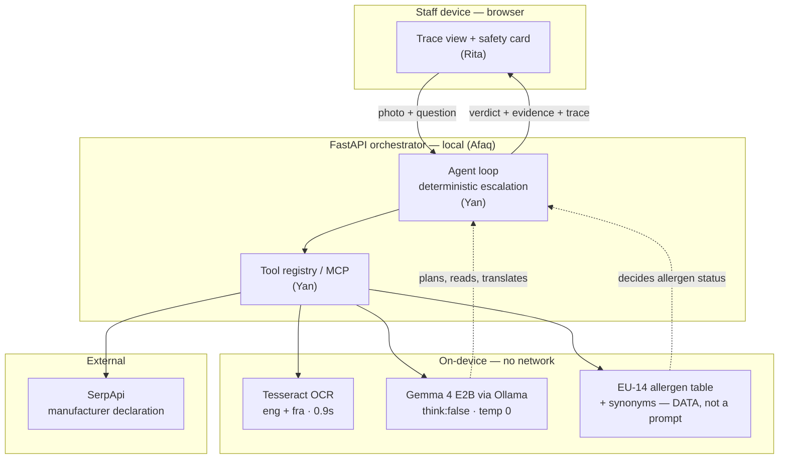
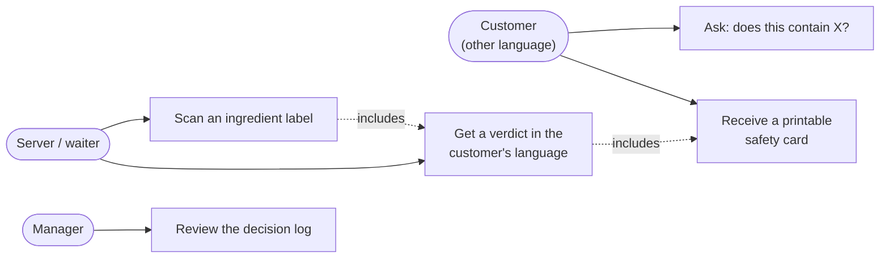
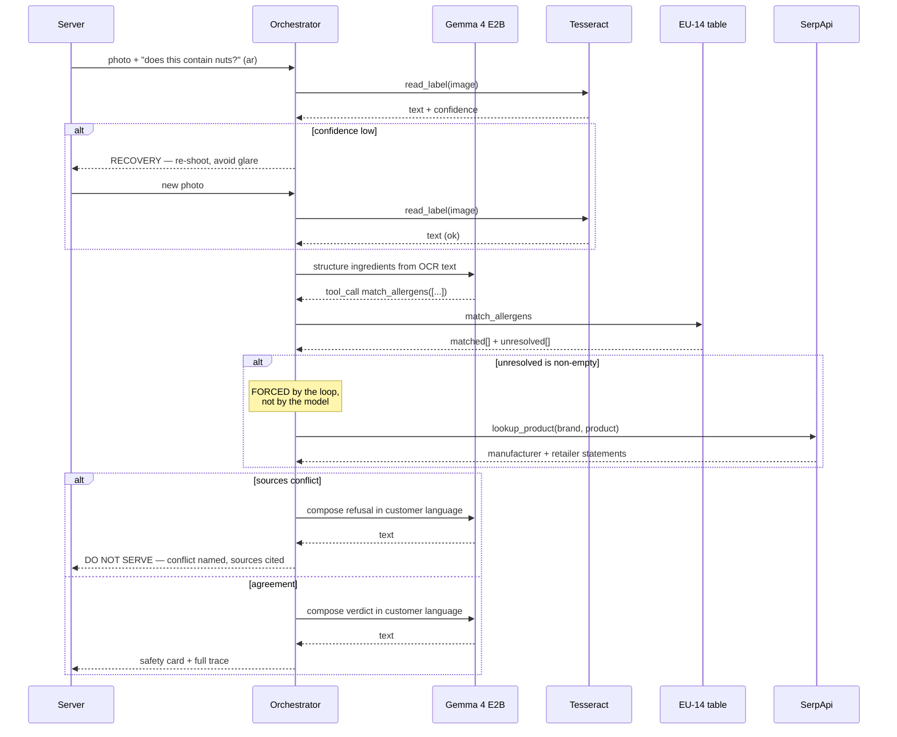

> Status: event-day design doc; see the [README](../README.md) for what shipped.

# SafePlate — technical spec

**Gemma 4 Hackathon | Paris · Track 2 — Autonomous Agents · 25 July 2026**
Team: Rita (product/frontend) · Afaq (data/backend) · Yan (agent loop/MCP) · Pyae (Gemma/eval)

> **This file is the technical handoff — schemas, gate results, stack.**
> **For scope, persona and timing, `safeplate-mvp-decision.md` overrides §4 and §10 below.**

---

## 1. Gate results — measured today, not assumed

| Gate                              | Result            | Consequence for the build                                                  |
| --------------------------------- | ----------------- | -------------------------------------------------------------------------- |
| **E2B emits tool calls**          | ✅ **PASS**       | Well-formed call, arguments extracted verbatim. The agent loop is viable.  |
| **E2B consumes tool results**     | ✅ **PASS**       | Second turn used the tool output and answered correctly.                   |
| **E2B escalates on its own**      | ❌ **FAIL**       | **See §2. This is the most important finding.**                            |
| **E2B vision reads printed text** | ❌ **FAIL**       | Echoed the prompt, then emitted `1 2 3 4 …`. Do not use vision for labels. |
| **Tesseract OCR**                 | ✅ **PASS**       | **0.90 s**, clean transcription. This is the label reader.                 |
| **SerpApi nutrition endpoint**    | ⚠️ **WRONG TOOL** | Returns nutrition, not allergens. See §5.                                  |

### Measured latency

| Call                                                          | Time       |
| ------------------------------------------------------------- | ---------- |
| First tool-calling turn (tool schemas in context, model cold) | **24.0 s** |
| Subsequent turns, warm                                        | **7.3 s**  |
| Tesseract OCR, one label                                      | **0.90 s** |
| Plain generation, short prompt, warm                          | ~4.1 s     |

A six-step agent run is therefore roughly **24 s + 5 × 7 s ≈ 60 s**, not 6 × 4 s.
**Re-time on the final prompt before quoting anything in the pitch, and quote what the
recording shows.**

---

## 2. The finding that shapes the architecture

Given ingredients including `casein` and the unresolved token `natural flavourings`, E2B
correctly called `match_allergens`. When handed back a result containing
`"unresolved": ["natural flavourings"]`, **it did not call `lookup_product`.** It simply
answered about the casein and stopped.

**A 2B model cannot be trusted to remember to escalate.**

**Therefore: escalation is deterministic, enforced by the orchestrator, not by the model.**

```
if result.unresolved:            # not "if the model decides to"
    force_tool("lookup_product")
if sources_conflict(evidence):
    force_tool("escalate")       # refuse; never average conflicting sources
```

This is a strength, not a workaround, and it is the honest thing to write up:
**the agent's reliability comes from the harness, not from hoping a small model plans well.**
Track 2 asks whether the agent survives contact with failure — a control loop that guarantees
escalation is a better answer than a model that usually remembers to.

---

## 3. Architecture



### The split that answers "what about hallucination?"

| Gemma 4 E2B owns                             | The lookup table owns                                |
| -------------------------------------------- | ---------------------------------------------------- |
| Reading OCR text into structured ingredients | **Whether an ingredient is a declarable allergen**   |
| Translating staff ↔ customer language        | Synonym resolution: casein → milk, semolina → gluten |
| Choosing the next tool                       |                                                      |
| Composing the final explanation              |                                                      |

**A language model is never the last line of defence.** The reasoning is learned; the safety
call is deterministic and auditable. Gemma is still unambiguously core — it plans, reads and
speaks — which is what rule §1.5 requires.

---

## 4. Use cases

> ⚠️ **SUPERSEDED by `safeplate-mvp-decision.md` §1–§3.** The three-actor model below was cut at
> 13:30: the **server is the only operator**, the chef answers one question on the server's screen,
> and the manager review log and printable card are out of scope.



**Primary flow:** a customer asks about an allergen in a language the server doesn't speak.
The server photographs the jar. SafePlate answers in the customer's language, cites the
evidence, and prints a card — or refuses.

**The valuable output is often the refusal.** "Do not serve, I can't confirm" is a correct,
useful answer, and it is what distinguishes this from a chatbot.

---

## 5. ⚠️ SerpApi — correcting the endpoint choice

**`https://serpapi.com/google-nutrition-information` is the wrong tool for SafePlate.**

It uses `engine=google` with `q=<food>` and returns a `nutrition_information` object:
`calories`, `total_fat`, `saturated_fat`, `sodium`, `potassium`, `total_carbohydrate`,
`dietary_fiber`, `sugar`, `protein`, `vitamin_c`, `calcium`, `iron`, `vitamin_b6`,
`magnesium`, plus `amount_per`, `source` (usually USDA) and `source_link`.

**There is no allergen field.** Nutrition is not an allergen declaration — a product can be
fully described nutritionally and still say nothing about traces of nuts.

### What to use instead

```
GET https://serpapi.com/search
    ?engine=google
    &q=<brand> <product> allergens ingredients
    &num=5
```

Then keep results whose domain is the manufacturer or a major retailer, and extract the
declaration text. Optionally restrict with `site:` for a known brand.

**Keep the nutrition call as a secondary signal** — a hit confirms the product was identified
correctly, which is useful evidence for the card and a genuine second SerpApi engine in the
integration. Just never present it as allergen information.

### Credits

Only _successful_ searches consume credits; cached and errored ones don't. Result count
doesn't matter — 0 results and 100 results each cost one credit. The hackathon's **$500
starter pool is request-based and explicitly not a guaranteed prize** — ask early, and cache
fixtures so the demo runs without network.

---

## 6. The agent loop



---

## 7. Frozen tool contracts

**Freeze these first. Everyone codes against the schema, not against each other's progress.**

```jsonc
// read_label
{"name":"read_label",
 "args":{"image_path":"str"},
 "returns":{"text":"str","confidence":0.0,"lang":"str"}}

// match_allergens  — deterministic, no model involved
{"name":"match_allergens",
 "args":{"ingredients":["str"]},
 "returns":{"matched":[{"ingredient":"str","allergen":"str","via":"synonym|direct"}],
            "unresolved":["str"]}}

// lookup_product  — SerpApi
{"name":"lookup_product",
 "args":{"brand":"str","product":"str"},
 "returns":{"statements":[{"source":"str","url":"str","text":"str","declares":["str"]}]}}

// escalate  — terminal
{"name":"escalate",
 "args":{"reason":"str","evidence":[{}]},
 "returns":{"verdict":"do_not_serve","card":{}}}
```

The **EU 14 declarable allergens** (Regulation (EU) No 1169/2011) are the table's key set:
cereals containing gluten · crustaceans · eggs · fish · peanuts · soybeans · milk · nuts ·
celery · mustard · sesame · sulphur dioxide and sulphites · lupin · molluscs.

---

## 8. Stack

| Layer        | Choice                                     | Note                                                                                              |
| ------------ | ------------------------------------------ | ------------------------------------------------------------------------------------------------- |
| Model        | `gemma4:e2b` via **Ollama**                | 7.2 GB, **on one laptop only** — demo from that machine                                           |
| Model call   | Ollama HTTP `/api/chat` with `tools`       | `think:false`, `temperature:0`                                                                    |
| OCR          | **Tesseract** (`eng`, `fra`)               | Binary at `C:\Program Files\Tesseract-OCR\tesseract.exe`; `TESSDATA_PREFIX` → project `tessdata/` |
| Orchestrator | **FastAPI**, local                         | Afaq's stack                                                                                      |
| Tools/MCP    | Python, alongside existing `mcp_server.py` | Yan — no second runtime                                                                           |
| External     | **SerpApi** `engine=google`                | Cache fixtures for offline demo                                                                   |
| Frontend     | Adapt `ui/` skeleton                       | Rita                                                                                              |

> **`think: false` is load-bearing.** E2B emits a hidden chain-of-thought in Ollama's separate
> `thinking` field — invisible output you still wait for. Disabling it cut latency ~3×. The
> installed Ollama client (0.4.7) has no `think` parameter, which is why the code calls the
> loopback HTTP API directly. **Do not undo this.**

### Code that carries over (`sejour_pour_tous/`)

Kept under its original package name — renaming mid-hackathon breaks imports for no score.

- **`llm.py`** — tuned Ollama client. Needed as-is.
- **`ocr.py`** — Tesseract wrapper; binds binary + `TESSDATA_PREFIX`. Becomes `read_label`.
- **`verification.py`** — post-generation guardrail over claims.
- **`grounding.py`** — cite-or-refuse generation.
- **`models.py`, `config.py`** — shared types and paths.

Not used: `understanding.py`, `retrieval.py`, `pipeline.py`.

Rules §4.3 permit pre-existing components; they require only that prior work isn't presented
as new. One sentence in the writeup's engineering-process section covers it.

---

## 9. Ownership

| Who      | Owns                                              | Boundary                                   |
| -------- | ------------------------------------------------- | ------------------------------------------ |
| **Yan**  | Agent loop, tool registry, forced escalation, MCP | Consumes tool schemas; owns control flow   |
| **Afaq** | SerpApi lookup, normalisation, cache, FastAPI     | Returns `statements[]`                     |
| **Rita** | Trace view, safety card, staff journey, pitch     | Consumes orchestrator JSON                 |
| **Pyae** | Gemma integration, EU-14 table, eval set          | Owns `read_label` → structured ingredients |

**Eval set:** ~15 labels with known allergens, **including two designed to be unresolvable**
so that refusal is measurable rather than anecdotal. Score: correct allergen detection,
correct refusal, no false "safe".

---

## 10. Timeline

> ⚠️ **SUPERSEDED by `safeplate-mvp-decision.md` §7.** Deadline confirmed on the Kaggle page at
> 13:26 as **18:00 GMT+2**. Feature freeze moved to **16:30**. SerpApi starter credits are no
> longer needed — the free plan's **250 searches/month** covers the build and the demo.

## 11. Submission checklist

- [ ] Every member joined the competition individually, team formed (max 5)
- [ ] **Kaggle Writeup** — title, subtitle, **Track 2 selected**, problem, architecture, how
      Gemma 4 is used, challenges, technical decisions, ≤1,500 words
- [ ] **Public repo** — no login, documented, OSI licence (`LICENSE`, MIT present)
- [ ] **Working demo** — an _interactive terminal recording_ is explicitly accepted; no hosting
      required
- [ ] Disclose pre-existing components in the engineering-process section
- [ ] No secrets in the repo (`.pkpass`, `.env`, API keys are gitignored)
